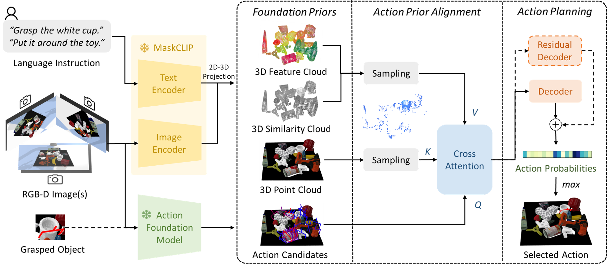

# Efficient Alignment of Unconditioned Action Prior for Language-conditioned Pick and Place in Clutter
This is the official repository for the paper: Efficient Alignment of Unconditioned Action Prior for Language-conditioned Pick and Place in Clutter.

[Paper](https://arxiv.org/abs/2503.09423) | [Video](https://www.bilibili.com/video/BV1dPX4YzEzk/?spm_id_from=333.1391.0.0)

We study the task of language-conditioned pick and place in clutter, where a robot should grasp a target object in open clutter and move it to a specified place. Some approaches learn end-to-end policies with features from vision foundation models, requiring large datasets. Others combine foundation models in a zero-shot setting, suffering from cascading errors. In addition, they primarily leverage vision and language foundation models, focusing less on action priors. In this paper, we aim to develop an effective policy by integrating foundation priors from vision, language, and action. We propose A2, an action prior alignment method that aligns unconditioned action priors with 3D vision-language priors by learning one attention layer. The alignment formulation enables our policy to train with less data and preserve zero-shot generalization capabilities. We show that a shared policy for both pick and place actions enhances the performance for each task, and introduce a policy adaptation scheme to accommodate the multi-modal nature of actions. Extensive experiments in simulation and the real-world show that our policy achieves higher task success rates with fewer steps for both pick and place tasks in clutter, effectively generalizing to unseen objects and language instructions.



#### Contact

Any question, please let me know: kcxu@zju.edu.cn

## Setup
###  Installation

- Ubuntu 20.04
- Torch 1.10.1
- Cuda 11.3
- GTX 4090 is tested

```
git clone git@github.com:xukechun/Action-Prior-Alignment.git
cd Action-Prior-Alignment

conda create -n a2 python=3.8
conda activate a2

pip install -r requirements.txt

python setup.py develop

cd models/graspnet/pointnet2
python setup.py install

cd ../knn
python setup.py install
```

###  Potential Issues of Installation
- When installing graspnetAPI, the following problem might occur:
```
× python setup.py egg_info did not run successfully.
│ exit code: 1
╰─> [18 lines of output]
The 'sklearn' PyPI package is deprecated, use 'scikit-learn'
rather than 'sklearn' for pip commands.
```
solution:
```
export SKLEARN_ALLOW_DEPRECATED_SKLEARN_PACKAGE_INSTALL=True
```
- Check the compatible version of torch and torchvision of your machine (especially the cuda vision) if the following problem occurs:
```
RuntimeError: CUDA error: no kernel image is available for execution on the device
```
solution: to install torch with the right cuda version

###  Easy Installation

If you use conda, we provide our conda environment produced by ```conda-pack``` in this [link](https://drive.google.com/file/d/15y6PMeZdyIiSAmMOYTCEabAmZlr94mcQ/view?usp=sharing). NOTE: This environment is compatiable with CUDA 11.3.

Then you can easily build and activate the conda environment by
```
cd 'PATH OF YOUR CONDA ENVS'
mkdir a2
tar -xzvf a2.tar.gz -C a2
conda activate a2

python setup.py develop

cd models/graspnet/pointnet2
python setup.py install

cd ../knn
python setup.py install
```

### Assets
We provide the processed object models in this [link](https://drive.google.com/drive/folders/1WxKDFXJktoqiP0jmkDZrMCcNNBx5u-YM?usp=drive_link). Please download the file and unzip it in the `assets` folder.

### Data and Pre-trained Models
We provide our training data in this [link](). Please download the file and unzip it in the `data` folder. 

We provide our testing cases in this [link](https://drive.google.com/drive/folders/1OuTua-69NEeV7RYIi9nzR1jmdZEugB68?usp=sharing). Please download the file and unzip it in the `testing_cases` folder. 

We provide our pre-trained models in this [link](https://drive.google.com/drive/folders/1uoDGIgkcSi8okcr8qjKOaF57TyRaHRd_?usp=sharing). Please download the file and unzip it in the `logs` folder.

### Data Collection
- For pick data
```
bash scripts/data_collection/collect_data_grasp.sh
```
- For place data
```
bash scripts/data_collection/collect_data_place.sh
```

## Training

- Unified training for pick and place
```
bash scripts/train/train_clutter_gp_unified.sh
```
- Adaptation for place
```
bash scripts/train/train_clutter_gp_adaptive.sh
```


## Evaluation
To test the pre-trained model, simply change the location of `--model_path`:

- Pick
```
bash scripts/test/test_grasp.sh
```
- Place
```
bash scripts/test/test_place.sh
```
- Pick and place
```
bash scripts/test/test_pickplace.sh
```

## Citation

If you find this work useful, please consider citing:

```
@article{xu2025efficient,
  title={Efficient Alignment of Unconditioned Action Prior for Language-conditioned Pick and Place in Clutter},
  author={Xu, Kechun and Xia, Xunlong and Wang, Kaixuan and Yang, Yifei and Mao, Yunxuan and Deng, Bing and Xiong, Rong and Wang, Yue},
  journal={arXiv preprint arXiv:2503.09423},
  year={2025}
}
```
